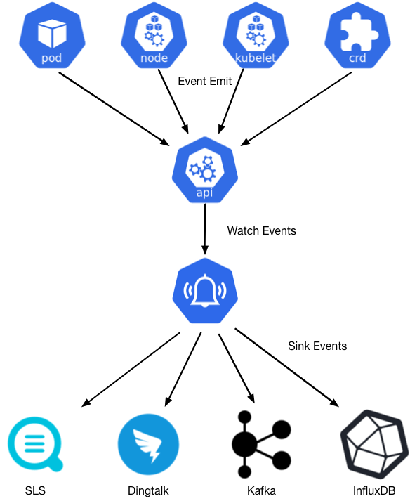
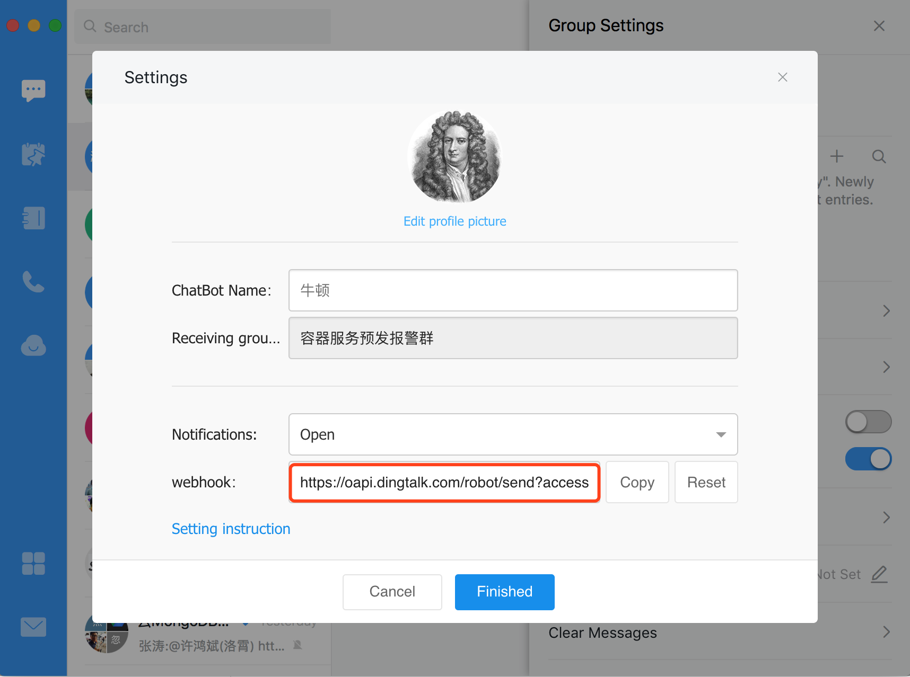
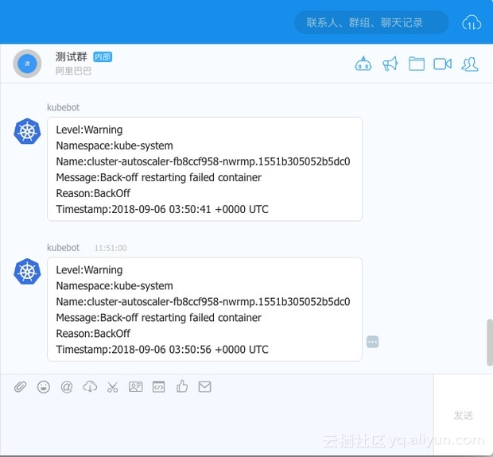

## kube-eventer    

<p align="center">
	   
  <p align="center">
    kube-eventer emit kubernetes events to sinks
  </p>
</p>

### Overview 
[](https://www.apache.org/licenses/LICENSE-2.0.html)
[](https://travis-ci.org/AliyunContainerService/kube-eventer)
[](https://codecov.io/gh/AliyunContainerService/kube-eventer)    

kube-eventer is an event emitter that sends kubernetes events to sinks(.e.g, dingtalk,sls,kafka and so on). The core design concept of kubernetes is state machine. So there will be `Normal` events when transfer to desired state and `Warning` events occur when to unexpected state. kube-eventer can help to diagnose, analysis and alarm problems.

### Architecture diagram
<p align="center">
	   
  <p align="center">
    Architecture diagram of kube-eventer
  </p>
</p>   

### Usage 
Here is a demo of kube-eventer with dingtalk sink. Dingtalk is an All-in-one Mobile Workplace like slack. Dingtalk sink can get kubernetes events from eventer. You can do chatops with it. Try it following the steps below.     

0. Get dingtalk token 
Add a chatbot in a dingtalk group and get bot token.   
    
 
1. Install eventer and configure sink 
```
apiVersion: apps/v1
kind: Deployment
metadata:
  labels:
    name: kube-eventer
  name: kube-eventer
  namespace: kube-system
spec:
  replicas: 1
  selector:
    matchLabels:
      app: kube-eventer
  template:
    metadata:
      labels:
        app: kube-eventer
      annotations:	
        scheduler.alpha.kubernetes.io/critical-pod: ''
    spec:
      dnsPolicy: ClusterFirstWithHostNet
      serviceAccount: kube-eventer
      containers:
        - image: registry.aliyuncs.com/acs/kube-eventer:v1.2.7-ca03be0-aliyun
          name: kube-eventer
          command:
            - "/kube-eventer"
            - "--source=kubernetes:https://kubernetes.default"
            ## .e.g,dingtalk sink demo
            - --sink=dingtalk:[your_webhook_url]&label=[your_cluster_id]&level=[Normal or Warning(default)]
          env:
          # If TZ is assigned, set the TZ value as the time zone
          - name: TZ
            value: "Asia/Shanghai" 
          volumeMounts:
            - name: localtime
              mountPath: /etc/localtime
              readOnly: true
            - name: zoneinfo
              mountPath: /usr/share/zoneinfo
              readOnly: true
          resources:
            requests:
              cpu: 100m
              memory: 100Mi
            limits:
              cpu: 500m
              memory: 250Mi
      volumes:
        - name: localtime
          hostPath:
            path: /etc/localtime
        - name: zoneinfo
          hostPath:
            path: /usr/share/zoneinfo
---
apiVersion: rbac.authorization.k8s.io/v1
kind: ClusterRole
metadata:
  name: kube-eventer
rules:
  - apiGroups:
      - ""
    resources:
      - configmaps
      - events
    verbs:
      - get
      - list
      - watch
---
apiVersion: rbac.authorization.k8s.io/v1
kind: ClusterRoleBinding
metadata:
  name: kube-eventer
roleRef:
  apiGroup: rbac.authorization.k8s.io
  kind: ClusterRole
  name: kube-eventer
subjects:
  - kind: ServiceAccount
    name: kube-eventer
    namespace: kube-system
---
apiVersion: v1
kind: ServiceAccount
metadata:
  name: kube-eventer
  namespace: kube-system
```
2. View events in dingtalk


### Sink Configure 
Supported Sinks:

| Sink Name                    | Description                       |
| ---------------------------- | :-------------------------------- |
| <a href="docs/en/dingtalk-sink.md">dingtalk</a>      | sink to dingtalk bot              |
| <a href="docs/en/sls-sink.md">sls</a>           | sink to alibaba cloud sls service |
| <a href="docs/en/elasticsearch-sink.md">elasticsearch</a> | sink to elasticsearch             |
| <a href="docs/en/honeycomb-sink.md">honeycomb</a>     | sink to honeycomb                 |
| <a href="docs/en/influxdb-sink.md">influxdb</a>      | sink to influxdb                  |
| <a href="docs/en/kafka-sink.md">kafka</a>         | sink to kafka                     |
| <a href="docs/en/mysql-sink.md">mysql</a>               | sink to mysql database           |
| <a href="docs/en/wechat-sink.md">wechat</a>               | sink to wechat           |
| <a href="docs/en/webhook-sink.md">webhook</a>               | sink to webhook           |
| <a href="docs/en/mongodb-sink.md">mongodb</a>               | sink to mongodb           |

### Contributing 
Please check <a href="docs/en/CONTRIBUTING.md" target="_blank">CONTRIBUTING.md</a>

You can also ask for help in our Dingtalk group.
dingtalk group1 (full): 30612594
dingtalk group2: 5605020816
<p align="center">
  
</p>


### License 
This software is released under the Apache 2.0 license.
